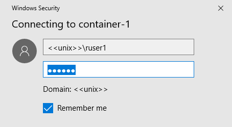

# Using Docker Container with RTVS
RTVS client v1.3 onwards supports working with docker containers. Please install `Docker for Windows`, before using this feature.

## Creating a container

1. Click on the **Containers...** button on the right hand corner of the **Workspaces** window.


2. That should bring you to the **Containers** window.


3. Click on *Create* button.


4. Enter a name for the container, a username , and a password. The username and password will be used to create an account on linux which you will connect to in the later step. Click on *Create* button at the bottom after you are done.


5. RTVS will build the image and start the container. You can Stop, Remove, or Restart the container from the **Containers** window.


## Connecting to a container

1. A container that is running RTVS daemon on port 5444 will show up in the **Local Running Containers** section of the **Workspaces** window.


2. You can connect to any container listed here by double clicking or clicking on the connect button.


## Using custom built images

RTVS Container feature will detect and allow management of containers created using custom built images. Here is a sample docker image built using microsoft/rtvs image. The base image used below has rtvs-daemon, R 3.4.2, and common R packages pre-installed. Change the **username** and **password** in the Dockerfile below as needed.

```
FROM microsoft/rtvs:1.3-ub1604-r3.4.2
RUN useradd --create-home ruser1
RUN echo "ruser1:foobar" | chpasswd
```

Note the username and password. Build the image using following commands. Change the container **name** as needed:

```
docker build -t my-rtvs-image:latest .
docker run -p 6056:5444 --name my-rtvs-container my-rtvs-image:latest rtvsd
```

In the `docker run` command, we used port 6056 to map to internal port 5444. RTVS uses this to detect rtvs-daemon. Any container which uses exposes container port 5444 will be listed in the RTVS Container UI. You can now connect to `my-rtvs-container` from the workspaces window. You will need to use `<<unix>>\ruser1` as the username while connecting.


