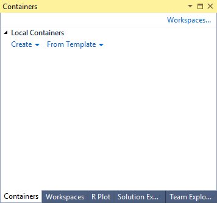
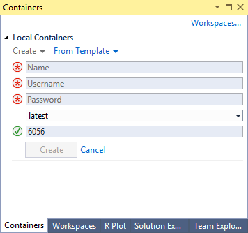

# Using Docker Container with RTVS
RTVS client v1.3 onwards supports working with docker containers. Please install `Docker for Windows`, before using this feature.

## Creating a container

1. Click on the **Containers...** button on the right hand corner of the **Workspaces** window.

2. That should bring you to the **Containers** window.

3. Click on *Create* button.

4. Enter a name for the container, a username , and a password. The username and password will be used to create an account on linux which you will connect to in the later step. Click on *Create* button at the bottom after you are done.

5. RTVS will build the image and start the container. You can Stop, Remove, or Restart the container from the **Containers** window.

## Connecting to a container

1. A container that is running RTVS daemon on port 5444 will show up in the **Local Running Containers** section of the **Workspaces** window.

2. You can connect to any container listed here by double clicking or clicking on the connect button.

